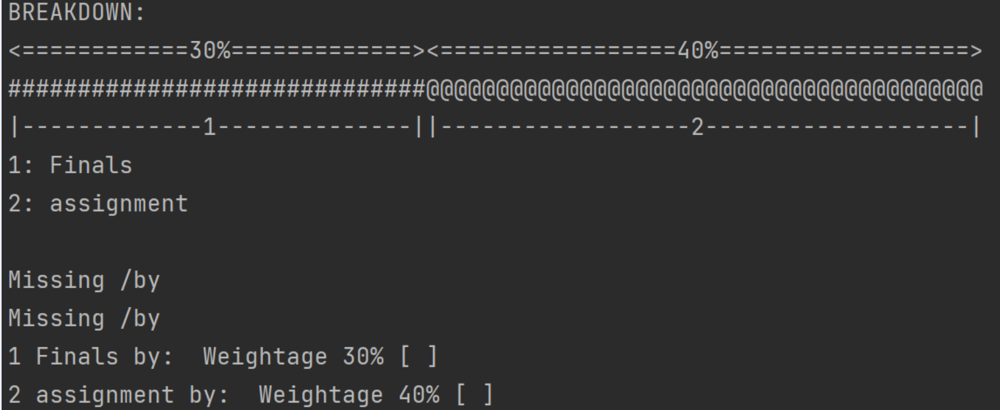
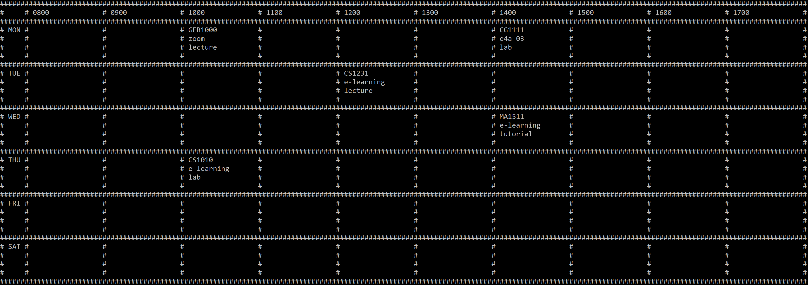

# User Guide

## Introduction

NoCap (NC) is a **desktop app for managing modules taken in NUS, optimized for use via a Command Line Interface** (CLI).
If you can type fast, NC can get your module management tasks done faster than traditional GUI apps. It is the perfect
app for NUS students!

## Quick Start

1. Ensure that you have Java 11 or above installed.
2. Down the latest version of `Duke` from [here](https://github.com/AY2122S1-CS2113T-F11-1/tp/releases).
3. Move the downloaded NoCap.jar to an empty directory.
4. Navigate to this directory on the Command Prompt.
5. Run NoCap.jar using the command `java -jar NoCap.jar`.

## Features

### **Command format:**

* Words in `<>` are the parameters to be supplied by the user. \
  e.g. `add <module name>` `<module name>` is the name of the module supplied by the user.
* Items in curved brackets describe the input format. \
  e.g.` /m <module name> addtask <description> /by <deadline (dd/MM/yyyy hhmm)` "dd/MM/yyyy hhmm" refers to the date-month-year and 24 hour time of the description.
* Parameters must be in the exact order as seen in the user guide. \
  e.g. if the command
  specifies `/m CG1111 addclass MON/0800/E1-03/tutorial`, `/m CG1111 addclass 0800/E1-03/tutorial/MON/`
  is not acceptable.
* Extraneous parameters for commands that do not take in parameters (such as `help`, `timetable `and `exit`) is not
  acceptable. \
  e.g. if the command specifies `help 123`, there will be an error.

### Viewing help : `help`
Shows a message explaining how to use NoCap

### Listing semesters : `list semesters`
Lists all preloaded semesters and their corresponding indexes  

Example output:

```
    1 : Y1S1
    2 : Y1S2
    3 : Y2S1
    4 : Y2S2
    5 : Y3S1
    6 : Y3S2
    7 : Y4S1
    8 : Y4S2
    9 : Y5S1
    10 : Y5S2
```

### Switching semesters : `switch <semester index>`

Switches the currently accessed semester to the corresponding input index. (refer to `list semesters` for the index)

Examples:

* `Switch 1`
* `Switch 2`

### Adding module: `add <module>`

Adds a module  

Examples:

* `add CS2113T`
* `add MA1508`

### Delete module: `delete <module index> `

Deletes a module corresponding to the input index. (refer to `list module` for indexes )

Examples:

* `delete 1`
* `delete 2`

Example output:

```
CS2113T has been successfully deleted
Remaining Modules are: 
1
Module name: CS2040C
CREDITS: 4
--------------------------- 
SCHEDULE: 
--------------------------- 
GRADE: A
TASKS: []
BREAKDOWN: 
```

### List module : `list module`

Lists all added modules and their corresponding indexes.

### Add task to module : `/m <module> addtask <description> /by <date> <time>`

* The `date` is in the format of dd/MM/yy.
* The `time` is in the format of hhmm.
* The `description` can contain white spaces.

Note:

* If time is omitted, time will default to 0000 hrs.
* If duplicate task exist and has a different deadline, the existing task's deadline will be updated with the new
  deadline.
* If duplicate task has same deadline, new task will be rejected by the program.

Example of usage:

* `/m cs1010 addtask Remember to S/U /by 20/11/2020 0000`

Example of expected output:


### Add gradable task to module : `/m <module> addgradable`

Adds a Gradable Task to the module.
* Refer to Add Task for deadline format.

Note:
* The weightage needs to be a number between 0 - 100.
* The total value of all gradable tasks within the module needs to be less than or equals to 100, else a error message will be shown.

Examples:
* `/m CS2113 addgradable Finals /by 10/10/10 1000 /w 30`
* `/m CS1010 addgradable assignments /by 10/10/10 1000 /w 40`

Expected output:


### Edit description of task : `/m <module> editdesc <task index> <new description>`

Edit the description of a task. 

### Edit deadline of task : `/m <module> editdate <task index> <new date>`

Edit the deadline of a task.

### Delete task from module : `/m <module> deletetask <substring>`

Finds and list down tasks with the substring. Type corresponding index to delete the task.

### Marks module task as done : `/m <module> done <task index>`

Mark task as done.

Other similar commands include:  
Mark task as not done: `/m <module> notdone <task index>`  
Mark gradable task as done:`/m <module> gradabledone <task index>`  
Mark gradable task as not done:`/m <module> gradablenotdone <task index>`  
  

### Listing module tasks : `/m <module> list task`

Shows a list of task of specified module.

Additional Format: `/m <module> list task <optional argument>`

By default, all tasks in the module specified in the current semester are listed, but this can be customised by adding
optional arguments.

&lt;optional argument> includes:

* sortbydate - Sort tasks by due date, the closest deadline have the higher priority in the list. does not print the
  task list.
* sortbystatus - Sort tasks by status, finished tasks of lower priority. Does not print task list.
* w - list tasks due within the next week.
* m - list tasks due within the next month.
* y - list tasks due within the next year.

Examples with expected output:

Assuming tasks have been added to modules beforehand:

* `/m cs1010 list task`

    ```
    Task List for CS1010: 
  1.[LATE][X] Remember to S/U by: 20 Nov 2020 12:00 AM
  2.[LATE][ ] Remember to drop out by: 12 Dec 2020 11:59 PM
  3.[ ] retake cs1010 by: 12 Dec 2021 11:59 PM
  4.[ ] do assignment by: 30 Oct 2021 04:00 PM
  ```


* `/m cs1010 list task sortbydate`

  ```
  CS1010 successfully sorted by date
  ```

  ```
  /m cs1010 list task
  ```

  ```
  Task List for CS1010: 
  1.[LATE][X] Remember to S/U by: 20 Nov 2020 12:00 AM
  2.[LATE][ ] Remember to drop out by: 12 Dec 2020 11:59 PM
  3.[ ] do assignment by: 30 Oct 2021 04:00 PM 
  4.[ ] retake cs1010 by: 12 Dec 2021 11:59 PM
  
  ```


* `/m cs1010 list task w`

  ```
  Task List for CS1010: 
  There are 3 tasks due within 7 days 
  1.[LATE][X] Remember to S/U by: 20 Nov 2020 12:00 AM
  2.[LATE][ ] Remember to drop out by: 12 Dec 2020 11:59 PM
  3.[ ] do assignment by: 30 Oct 2021 04:00 PM 
  ```

NOTE:

For optional arguments w, m and y, overdue tasks are listed together with the weekly/monthly/yearly tasks regardless of
due date as a reminder that the user has forgotten to do the task.

### Add class to module : `/m <module> addclass <day/period/location/comments>`

Adds a class to a module

Examples:

* `/m CG1111 addclass MON/0800/E1-03/tutorial`
* `/m MA1508 addclass WED/1000/zoom/lecture`

Note:

* DAY can only take on the following inputs in both uppercase and lowercase: {MON, TUE, WED, THU, FRI, SAT, SUN}
* PERIOD is a 1hr block in 24hr format
* Examples:

<table>
  <tr>
   <td>
Valid
   </td>
   <td>Invalid 
   </td>
  </tr>
  <tr>
   <td>0800
   </td>
   <td>0830
   </td>
  </tr>
  <tr>
   <td>1000
   </td>
   <td>2500
   </td>
  </tr>
  <tr>
   <td>0000
   </td>
   <td>11111
   </td>
  </tr>
</table>

* LOCATION and COMMENTS can only take on a maximum of 16 characters and cannot be empty
* Only one class can be added in any period

### Delete classes from module: `/m <module> deleteclass <class index>`

Deletes a module corresponding to the input index.(refer to `/m <module name> info` or `list module` for indexes )

Examples:

* `/m CS2040C deleteclass 1`
* `/m CG1112 deleteclass 2`

Example output:

```
Class: 
Day: TUE
Start Time: 1000
Location: zoom
Comments: lect
has been successfully deleted

Remaining Classes are: 
1.
Day: MON
Start Time: 1000
Location: zoom
Comments: lect
```

### Add grade to module: `/m <module> addgrade <grade letter>`

Adds a grade to a module

Examples:
* `/m CS2113 addgrade A`
* `/m MA1508 addgrade B-`

Example output:
```/m cs2040c addgrade A
Module grade successfully added: 
Module name: CS2040C
CREDITS: 4
--------------------------- 
SCHEDULE: 
--------------------------- 
GRADE: A
TASKS: []
BREAKDOWN: 
```

### Delete grade from module: `/m <module> deletegrade`

Deletes the grade, if any.

Examples:
* `/m CS2113 deletegrade`
* `/m MA1511 deletegrade`

Example output:
```
Module grade has been successfully deleted
Module name: CS1010
CREDITS: 0
--------------------------- 
SCHEDULE: 
--------------------------- 
GRADE: null
TASKS: []
BREAKDOWN: 
```

### Add credit to module: `/m <module> addcredit `

Adds credits to a module.

Examples:
* `/m CS2113 addcredit 4`
* `/m MA1511 addcredit 2`

Example output:
```
Module credits successfully added:
Module name: CS2040C
CREDITS: 4
--------------------------- 
SCHEDULE:
--------------------------- 
GRADE: A
TASKS: []
BREAKDOWN:
```

### View Timetable : `timetable `

Shows the timetable for the currently accessed semester.

Example output:


Note:

* Timetable can only display classes from 0800 to 1700 periods

### Listing all tasks : `list task`

Shows a list of all tasks across modules

Additional format: `list task <optional argument>`

By default, all tasks in the current semester are listed, but this can be customised by adding optional arguments.

&lt;optional argument> includes:

* sortbydate - Sort tasks by due date.
* sortbystatus - Sort tasks by status, displaying finished tasks first.
* w - list tasks due within the next week.
* m - list tasks due within the next month.
* y - list tasks due within the next year.

Examples with expected output:

Assuming tasks have been added to modules beforehand:

* `list task`

    ```
    All tasks: 
    1. [CS2132][G][ ] Assignment by: 16 Dec 2021 12:00 AM [Weightage: 50%]
    2. [CS2132][G][LATE][ ] asdf by: 10 Dec 2000 12:00 AM [Weightage: 50%]
    ```


* `list task sortbydate`

  ```
  Tasks sorted by date: 
  1. [CS2132][G][LATE][ ] asdf by: 10 Dec 2000 12:00 AM [Weightage: 50%]
  2. [CS2132][G][ ] Assignment by: 16 Dec 2021 12:00 AM [Weightage: 50%]
  ```


* `list task w`

  ```
  Weekly tasks: 
  1. [CS2132][G][LATE][ ] asdf by: 10 Dec 2000 12:00 AM [Weightage: 50%]
  ```

NOTE:

For optional arguments w, m and y, overdue tasks are listed together with the weekly/monthly/yearly tasks regardless of
due date as a reminder that the user has forgotten to do the task.


### View CAP : `cap`

Shows the CAP for the currently accessed semester.

Example output:

* `This semester's CAP: 4.25`

### View all CAP : `allcap`

Shows the CAP for all semesters and aggregated CAP.

Format: `allcap`

Example output:

```
    Cumulative CAP: 4.25
    Y1S1: 4.25
    Y1S2: 0.0
    Y2S1: 0.0
    Y2S2: 0.0
    Y3S1: 0.0
    Y3S2: 0.0
    Y4S1: 0.0
    Y4S2: 0.0
    Y5S1: 0.0
    Y5S2: 0.0
```

### Exiting the program : `bye`

Exits the program.

## FAQ

**Q**: How do I transfer my data to another computer?

**A**: Simply transfer your data.json file to the data folder of the operating system that you plan to use NoCap on.

> **WARNING**: Replacing data.json file in another NoCap folder results in the  existing data being erased!

## Command Summary

|Action|Format|
|--------|----------|
|show help| help |
|Show all semesters| list semesters|
|Change semester| switch \<semester index>|
|Add module| add \<module name>|
|Delete module| delete \<module index>|
|List all module| list module|
|Add task| /m \<module> addtask \<description> /by \<date> \<time>|
|Add gradable task | /m \<module> addgradable \<description> /by \<date> \<time> /w \<weightage>|
|Edit description| /m \<module> editdesc \<task index> \<new description>|
|Edit deadline| /m \<module> editdate \<task index> \<new deadline>|
|Delete task| /m \<module> deletetask|
|Mark task as complete| /m \<module> done \<task index>|
|Mark task as incomplete| /m \<module> notdone \<task index>|
|Mark gradable task as complete| /m \<module> gradabledone \<task index>|
|Mark gradable task as incomplete| /m \<module> gradablenotdone \<task index>|
|List module tasks| /m \<module> list task \<optional argument>|
|Add class | /m \<module> addclass \<day/period/location/comments>|
|Delete class| /m \<module> deleteclass \<class index>|
|Add grade| /m \<module> addgrade \<grade letter>|
|Delete grade| /m \<module> deletegrade|
|Add credit| /m \<module> addcredit|
|Show timetable| timetable|
|List all tasks| list task \<optional argument>|
|Show module cap| cap|
|Show overall cap| allcap|
|Exit NoCap|bye|
