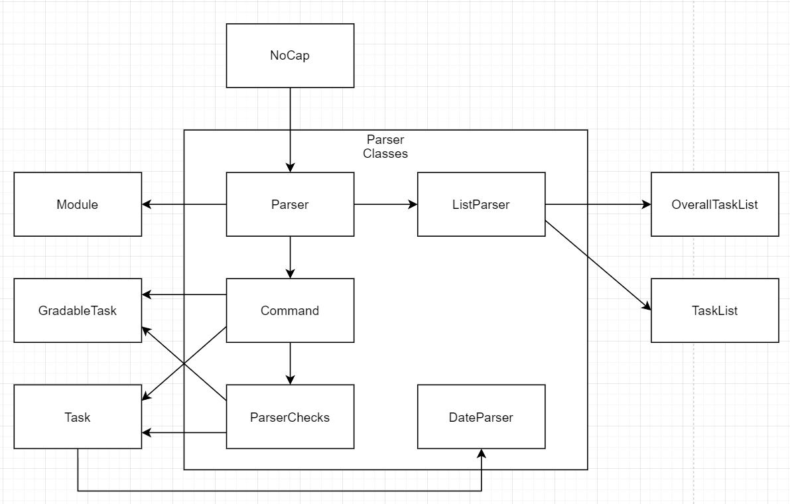
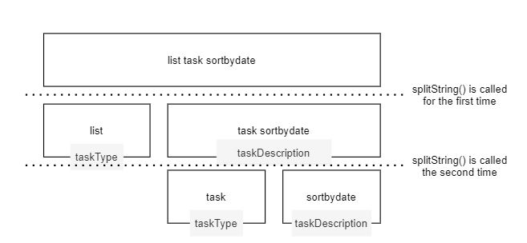

# Zeng Jiexiong - Project Portfolio Page

## Overview

### Summary of Contributions
* **Code Contributed:** [RepoSense Link](https://nus-cs2113-ay2122s1.github.io/tp-dashboard/?search=f11-1&sort=groupTitle&sortWithin=title&timeframe=commit&mergegroup=&groupSelect=groupByRepos&breakdown=true&checkedFileTypes=docs~functional-code~test-code~other&since=2021-09-25&tabOpen=true&tabAuthor=jiexiong-zeng&tabRepo=AY2122S1-CS2113T-F11-1%2Ftp%5Bmaster%5D&authorshipIsMergeGroup=false&authorshipFileTypes=docs~functional-code~test-code~other&authorshipIsBinaryFileTypeChecked=false&tabType=authorship)
* **Enhancement Implemented:** Parser package consisting of: Parser, ListParser, DateParser, ParserChecks, Command
  * Processes all user inputs and parses them for information, calling the corresponding methods from other classes. Checks for input validity errors (Whether the desired input exists, eg: missing date time string).

* **Contributions to UG:** Command Summary, Reorganise structure, clean up and uniform syntax. 
* **Contributions to DG:** Design and Implementation Parser section, Appendix B: User Stories.
* **Contributions to team-based tasks:** 
  * Setting up the GitHub team org/repo.
  * Scribing to-dos in team meetings and creating corresponding issue trackers.
  * Managing team deadlines and creating releases.

### Developer Guide Extract

**API** : <code>command.parser </code>

The Parser classes is responsible for receiving user input and converting it into commands which are directly passed to
respective classes.

The class diagram below is an overview of relationship between Parser classes and other classes.

How the parsing works:

* `NoCap` passes the user input to `Parser` which separates the input into useful information such as taskType,
  taskDescription, Module, etc.
* When commands include **listing tasks**, the taskDescription is passed to `ListParser` which determines the method of
  sorting and creates filtered `OverallTaskList` and `TaskList` accordingly.
* Otherwise, the taskDescription is passed to `Command` which calls the corresponding commands in `SemesterList`,
  `Semester` ,`ModuleList`, `Module` , `Task`, `Gradable Task`. For clarity purposes, associations are shown but
  dependencies are not.
* `ParserChecks` is a utility class that handles various error checking and string searching methods such as
  `ParserSearch#getTaskFromIndex()` and `ParserSearch#getTaskFromKeyword()`. `Command` utilizes these methods to verify
  the Strings before passing them to other classes.
  *In NoCap, Parser verifies the validity of input (Whether it exists in the right format). Input content is verified by
  individual classes for correctness.*
* `DateParser` handles parsing String into LocalDateTime format and displaying LocalDateTime as String. It is utilized
  by `Task`. Additional date formats can be added in `DateParser#inputFormatter()`

Below is a step by step example of how the parser receives and decipher a user input. In this example, the user enters
`list task sortbydate`.

The Sequence Diagram below illustrates the process
  
**Note**: The alternate paths are omitted from the diagram for clarity.  

Step 1: The User launches the application. `NoCap` creates a new `Parser` instance through the constructor and `Parser`
creates `ListParser`.  

Step 2: The application waits for User input. User enters `list task sortbydate`. `NoCap` passes the input to `Parser`
through `Parser#chooseTask()`.  

Step 3: `splitInput` is called for the first time and splits the user input into `list` and `task sortbydate`.
> **TaskType** is set to `list`, and **TaskDescription** is set to `task sortbydate`.

**TaskType** matches a possible command String.
  

Step 4: `splitInput` is called for the second time and splits the user input into `task` and `sortbydate`.
> **TaskType** is set to `task`, and **TaskDescription** is set to `sortbydate`.

**TaskType** and **TaskDescription** are passed to `ListParser` through `ListParser#overallListParser`.
  

Step 5: `overallListParser` creates an `OverallTaskList`. Through nested switch cases, **TaskType** and **TaskDescription** are matched, and the corresponding method `OverallTaskList#sortByDateAndPrint()` is called. As the
name implies, this method sorts all tasks by date and prints them.
> If **TaskType** does not match, then an error message is displayed.  
> If **TaskDescription** does not match, all tasks are printed by default.

  
Step 6: The full command is carried out and the application returns to NoCap and waits for new User Input.  

The diagram below illustrates the `splitString` process:

